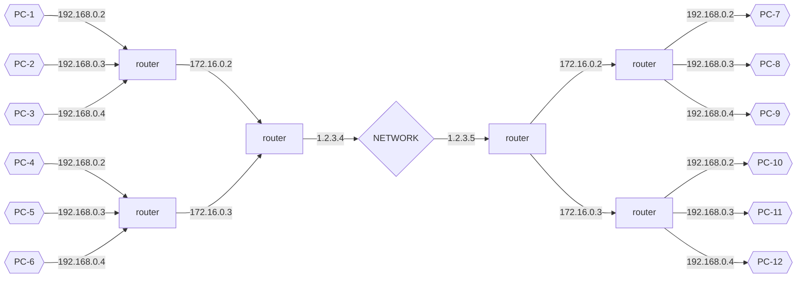
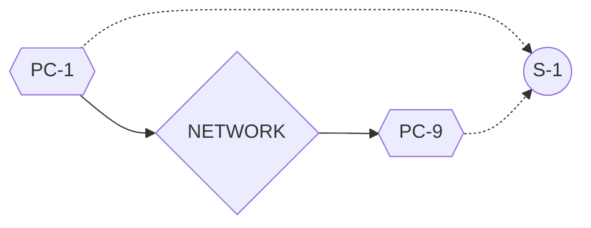
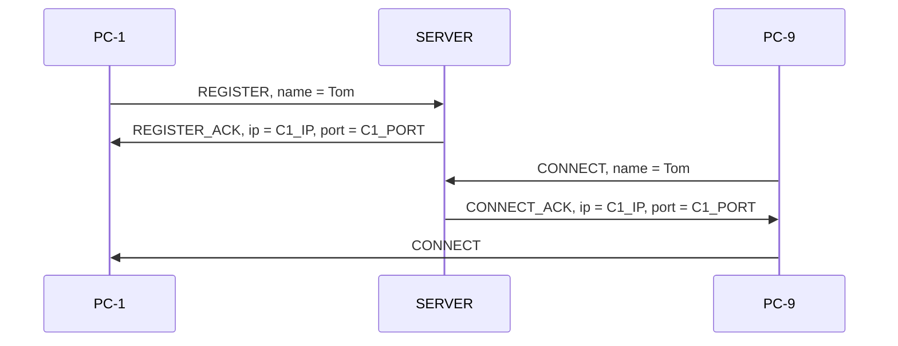

### What is it?

Simple server to connect machines behind NAT
chat
Each machine has Id and name

Typical NAT structure

`PC-1` can not connect to `PC-9` because, PC-9 does not have static IP

to resolve this issue, one can use external server `S-1` with public IP

Program flow

